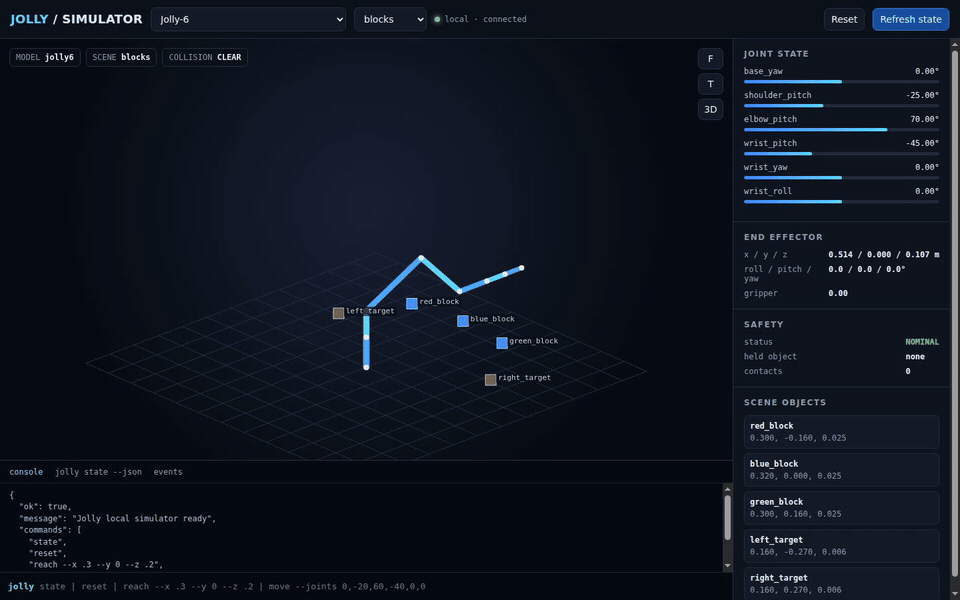
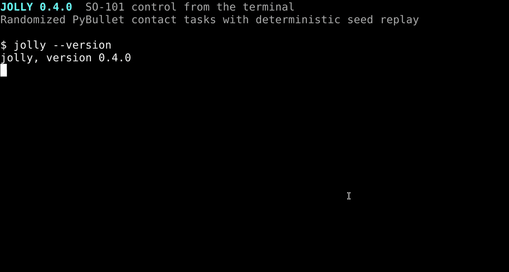

# Jolly CLI

Jolly provides two separate robot-control backends for terminal users and LLM
agents:

- `JollyEngine` executes measured contact tasks with the official SO-101 model
  in PyBullet.
- `SO101HardwareDriver` sends the real STS3215 serial protocol to a physical
  SO-101 and reads measured motor positions.

The two backends never combine their scores.

Jolly includes two offline robot profiles:

- `jolly6`: an original six-axis arm with a parallel gripper.
- `so101`: the official five-axis SO-101 URDF and CAD meshes with a gripper.

The package also accepts scenes, challenges, an engine benchmark, a native
PyBullet viewer, and an optional local web viewer. No cloud service, MCP server,
API key, or network connection is required at runtime.

## See Jolly 0.4.0 in action

### Interactive SO-101 simulator



[Watch the full WebM recording](docs/assets/jolly-web-demo.webm) ·
[Open the full-resolution still](docs/assets/jolly-so101-viewer.png)

The recording uses the official SO-101 CAD meshes in a real PyBullet world. It
switches camera views and executes a Cartesian reach in the insertion scene.
The viewport is not a diagram or a hand-drawn robot substitute.

### Randomized terminal benchmark and hardware commands



[Watch the MP4 recording](docs/assets/jolly-terminal-demo.mp4)

The terminal recording runs one benchmark case under seeds `1` and `3`. Each
case includes reach, obstacle, and drop-in-hole tasks. The aggregate scores
differ, and the recording then opens the separate physical SO-101 command help.

## Install

Install the command from PyPI with Python 3.10 or later:

```bash
python -m pip install jolly-cli
jolly state --json
```

For Python development, create a virtual environment on Python 3.10 or later:

```bash
python -m venv .venv
. .venv/bin/activate
pip install -e '.[web,dev]'
```

PyBullet publishes limited binary wheels. On platforms without a matching
wheel, use conda-forge or install a C++ build toolchain for the source build.

Install the local LLM skill with the Skills CLI:

```bash
npx skills add ./skills/jolly
```

## Quick start

```bash
jolly models --json
jolly reset --model so101 --scene blocks --json
jolly state --json
jolly move --joints "0,-20,40,-20,0" --gripper 0.0 --json
jolly reach --x 0.30 --y 0.10 --z 0.18 --gripper 0.0 --json
jolly render
jolly challenge list --json
jolly benchmark --seed 42017 --cases 3 --model so101 --json
```

Start the optional local web viewer:

```bash
jolly serve --host 127.0.0.1 --port 8765
```

Open `http://127.0.0.1:8765`. The JSON API documentation is at
`http://127.0.0.1:8765/api/docs`.

The clean web viewer displays the physical PyBullet world. PyBullet's local
TinyRenderer draws the official SO-101 STL meshes, scene objects, shadows, and
floor. Drag the viewport to orbit. Scroll to zoom. The viewer has no CDN,
external 3D service, or proprietary rendering dependency.

Open the native PyBullet window on a machine with a display:

```bash
jolly viewer --model so101 --scene blocks
```

## Command contract

All motion uses meters and degrees. Gripper `0.0` means open. Gripper `1.0`
means closed. Mutating commands save state under the operating system state
directory. Set `JOLLY_STATE_DIR` to isolate or relocate state.

Important commands:

| Command | Purpose |
| --- | --- |
| `jolly state --json` | Read joints, FK pose, collisions, objects, and grasp state. |
| `jolly move --joints CSV` | Move to exact joint angles. |
| `jolly reach --x X --y Y --z Z` | Solve IK and move to a Cartesian point. |
| `jolly fk [--joints CSV] --json` | Compute forward kinematics without saving a new pose. |
| `jolly render` | Show a Rich status table and terminal stick figure. |
| `jolly reset` | Select a model and scene, then home the robot. |
| `jolly scene list/load` | Discover and load deterministic scenes. |
| `jolly challenge list/start/status` | Run seeded randomized manipulation challenges. |
| `jolly benchmark [--seed N] [--cases N]` | Execute randomized reach, obstacle, and drop-in-hole contact tasks. |
| `jolly hardware state/move/benchmark/stop` | Control and measure a physical SO-101 over its serial bus. |

Jolly rejects joint-limit violations and unsafe workspace targets. By default,
Jolly rolls back a motion that creates a collision. Use `--allow-collision`
only for controlled collision tests.

## Architecture

```text
jolly-cli/
├── pyproject.toml
├── README.md
├── SKILL.md
├── LICENSE-MIT
├── LICENSE-APACHE
├── THIRD_PARTY_LICENSES.md
├── jolly/
│   ├── cli.py
│   ├── benchmark.py
│   ├── challenges.py
│   ├── driver.py
│   ├── engine.py
│   ├── assets/
│   │   ├── jolly6.urdf
│   │   └── robots/so101/
│   │       ├── so101_new_calib.urdf
│   │       ├── assets/*.stl
│   │       ├── LICENSE-APACHE
│   │       ├── CITATION.cff
│   │       └── SOURCE.md
│   ├── core/
│   │   ├── physics.py
│   │   ├── models.py
│   │   ├── scenes.py
│   │   └── store.py
│   └── web/
│       ├── app.py
│       └── index.html
├── skills/jolly/SKILL.md
└── tests/
```

## Physics scope

`JollyEngine` owns state, safety, motion rollback, constrained grasping,
rendering, and the physics-task contract. `JollyDriver` generates seeded
challenge and benchmark cases. The project does not depend on Inspect, Inspect
AI, or an external robotics benchmark driver.

PyBullet is the low-level open-source physics backend. It performs rigid-body
simulation, FK, IK, contact generation, and scene settling. Jolly uses
deterministic state restoration across short CLI processes.
The grasp helper attaches a nearby graspable object while the gripper is closed.
This helper makes terminal pick-and-place repeatable. It is not a soft-contact or
motor-current model.

## Randomized evaluation

Every challenge start generates a new target, object layout, or obstacle layout.
The result includes the seed and full instance so results stay auditable. Omit
`--seed` for a fresh unpredictable case. Supply a seed to reproduce a failure:

```bash
jolly challenge start sort-red --seed 42017 --json
jolly benchmark --seed 42017 --cases 5 --json
```

The benchmark physically executes randomized reach, obstacle avoidance, and
drop-in-hole tasks. Its score comes from measured reach error, collisions, grasp
state, physical release, and final peg pose. A generated health check does not
add points. Different seeds can produce different scores.

## Physical SO-101 hardware

Install direct physical-hardware support:

```bash
python -m pip install 'jolly-cli[hardware]'
```

Jolly implements the Feetech STS3215 packet protocol directly. It does not use
Inspect Robots or an external robot SDK. Copy and calibrate the example file
before enabling torque:

```bash
jolly hardware calibration-example --output so101-calibration.json
# Replace every placeholder with measurements from this physical arm.
jolly hardware scan --port /dev/ttyACM0 --calibration so101-calibration.json --json
jolly hardware state --port /dev/ttyACM0 --calibration so101-calibration.json --json
jolly hardware move --port /dev/ttyACM0 --calibration so101-calibration.json \
  --joints '0,0,0,0,0' --gripper 0 --confirm-hardware --json
jolly hardware benchmark --port /dev/ttyACM0 --calibration so101-calibration.json \
  --seed 42017 --cases 3 --confirm-hardware --json
jolly hardware stop --port /dev/ttyACM0 --calibration so101-calibration.json
```

The example calibration values are placeholders and set `calibrated` to false.
Measure every zero point, direction, and gripper endpoint before setting it to
true. Physical commands require an explicit confirmation, enforce degree and
raw-count step limits, set bounded goal speed, issue simultaneous goals, and
read motor feedback. The driver disables torque after communication failures.
After successful movement it keeps torque enabled so the arm does not fall.
Support the arm before running `jolly hardware stop`.

The physical benchmark scores measured joint-position error only. The physics
benchmark scores contact tasks only. Jolly never presents physics output as a
physical-hardware result.

The bundled SO-101 model is the official Apache-2.0 new-calibration URDF from
The Robot Studio. Jolly includes the 13 referenced STL meshes from pinned commit
`5f6d2b876a53a4872e405b991dd925556c9e38a4`. Jolly keeps the upstream files
unmodified and includes their license, citation, source record, and README.

## License

Jolly source code and original assets are available under your choice of the
MIT License or Apache License 2.0. See `LICENSE-MIT` and `LICENSE-APACHE`.
Third-party details appear in `THIRD_PARTY_LICENSES.md`.
