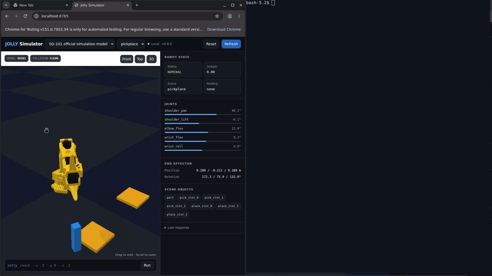
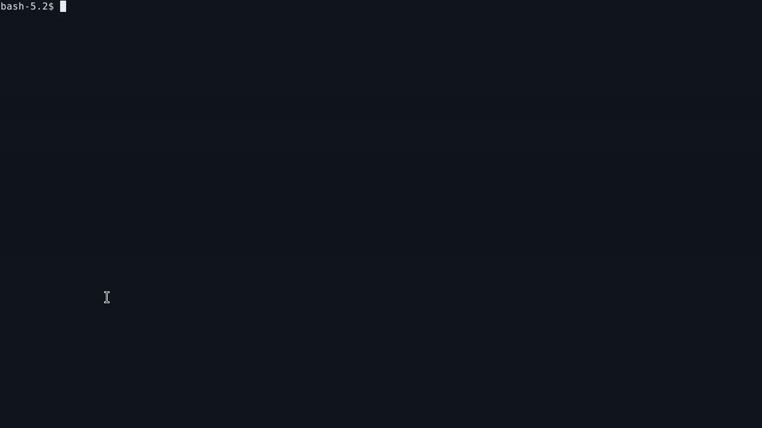

# Jolly CLI

Jolly runs explicit terminal controls and measures randomized pick-and-place trials.
Simulation uses real PyBullet rigid bodies. Hardware uses LeRobot motor I/O and
an independent object measurement provider. Jolly never scores commanded
coordinates, IK output, or motor positions as object placement.

| Arm | Simulation / Cartesian model | Hardware integration | Physically verified |
| --- | --- | --- | --- |
| SO-100 | Official bundled URDF | LeRobot Feetech, implemented | No |
| SO-101 | Official bundled URDF | LeRobot Feetech, implemented | No |
| Koch | Matching configured URDF required | LeRobot Dynamixel, implemented | No |
| jolly6 | Original bundled six-axis arm | Simulation only | No |
| Additional arms | Explicit registered URDF | Configured LeRobot class | No |

Core simulation works offline. Hardware requires calibration and real sensors.
No cloud service, MCP server, or API key is required.

## See Jolly 0.6.0 in action

### Simulator and terminal side by side



[Watch the split-screen MP4](docs/assets/jolly-split-controls-v060-r2.mp4) ·
[Open the full-resolution still](docs/assets/jolly-split-controls-v060-r2.png)

The left half shows the web viewer. The right half shows terminal commands and
unmodified Jolly output. The viewer refreshes after each terminal command.

### Operator-controlled randomized pick-and-place



[Watch the MP4 recording](docs/assets/jolly-terminal-controls-v060-r2.mp4)

The terminal recording shows approach, descent, grasp, lift, sideways motion,
alignment, lowering, and release. Each command runs against PyBullet. A second
trial deliberately places the part at the wrong destination. The recording shows
measured error for both trials and the resulting numeric success percentage.
The benchmark does not solve trials. Scoring advances physics to settle the part,
but sends no robot motion command.

## Install

Install the command from PyPI with Python 3.10 or later:

```bash
python -m pip install jolly-cli
jolly state --json
```

For Python development, create a virtual environment on Python 3.10 or later:

```bash
python -m venv .venv
. .venv/bin/activate
pip install -e '.[web,dev]'
```

PyBullet publishes limited binary wheels. On platforms without a matching
wheel, use conda-forge or install a C++ build toolchain for the source build.

Install the local LLM skill with the Skills CLI:

```bash
npx skills add ./skills/jolly
```

## Quick start

```bash
jolly models --json
jolly reset --model so101 --scene blocks --json
jolly state --json
jolly move --joints "0,-20,40,-20,0" --gripper 0.0 --json
jolly reach --x 0.30 --y 0.10 --z 0.18 --gripper 0.0 --json
jolly render
jolly challenge list --json
jolly benchmark start --seed 42017 --model so101 --json
# Read the generated part and pad coordinates, then issue explicit controls.
jolly benchmark score --json
```

Start the optional local web viewer:

```bash
jolly serve --host 127.0.0.1 --port 8765
```

Open `http://127.0.0.1:8765`. The JSON API documentation is at
`http://127.0.0.1:8765/api/docs`.

The clean web viewer displays the physical PyBullet world. PyBullet's local
TinyRenderer draws the official SO-101 STL meshes, scene objects, shadows, and
floor. Drag the viewport to orbit. Scroll to zoom. The viewer has no CDN,
external 3D service, or proprietary rendering dependency.

Open the native PyBullet window on a machine with a display:

```bash
jolly viewer --model so101 --scene blocks
```

## Command contract

All motion uses meters and degrees. Gripper `0.0` means open. Gripper `1.0`
means closed. Mutating commands save state under the operating system state
directory. Set `JOLLY_STATE_DIR` to isolate or relocate state.

Important commands:

| Command | Purpose |
| --- | --- |
| `jolly state --json` | Read joints, FK pose, collisions, objects, and grasp state. |
| `jolly move --joints CSV` | Move to exact joint angles. |
| `jolly reach --x X --y Y --z Z` | Solve IK and move to a Cartesian point. |
| `jolly fk [--joints CSV] --json` | Compute forward kinematics without saving a new pose. |
| `jolly render` | Show a Rich status table and terminal stick figure. |
| `jolly reset` | Select a model and scene, then home the robot. |
| `jolly scene list/load` | Discover and load deterministic scenes. |
| `jolly challenge list/start/status` | Run seeded randomized manipulation challenges. |
| `jolly benchmark start/status/score/next/report/history` | Run randomized measured trials; report success percentage and placement error. |
| `jolly arm list/state/move/reach/stop` | Use calibrated LeRobot hardware without simulator fallback. |
| `jolly hardware state/move/benchmark/stop` | Control and measure a physical SO-101 over its serial bus. |

Jolly rejects joint-limit violations and unsafe workspace targets. By default,
Jolly rolls back a motion that creates a collision. Use `--allow-collision`
only for controlled collision tests.

## Architecture

```text
jolly-cli/
├── pyproject.toml
├── README.md
├── SKILL.md
├── LICENSE-MIT
├── LICENSE-APACHE
├── THIRD_PARTY_LICENSES.md
├── jolly/
│   ├── cli.py
│   ├── benchmark.py
│   ├── challenges.py
│   ├── driver.py
│   ├── engine.py
│   ├── assets/
│   │   ├── jolly6.urdf
│   │   └── robots/so101/
│   │       ├── so101_new_calib.urdf
│   │       ├── assets/*.stl
│   │       ├── LICENSE-APACHE
│   │       ├── CITATION.cff
│   │       └── SOURCE.md
│   ├── core/
│   │   ├── physics.py
│   │   ├── models.py
│   │   ├── scenes.py
│   │   └── store.py
│   └── web/
│       ├── app.py
│       └── index.html
├── skills/jolly/SKILL.md
└── tests/
```

## Physics scope

`JollyEngine` owns state, safety, motion rollback, constrained grasping,
rendering, and the physics-task contract. `JollyDriver` generates seeded
challenge and benchmark cases. The project does not depend on Inspect, Inspect
AI, or an external robotics benchmark driver.

PyBullet is the low-level open-source physics backend. It performs rigid-body
simulation, FK, IK, contact generation, and scene settling. Jolly uses
deterministic state restoration across short CLI processes.
The grasp helper attaches one contacted graspable object while the gripper is closed.
This helper makes terminal pick-and-place repeatable. It is not a soft-contact or
motor-current model.

## Randomized evaluation

Every challenge start generates a new target, object layout, or obstacle layout.
The result includes the seed and full instance so results stay auditable. Omit
`--seed` for a fresh unpredictable case. Supply a seed to reproduce a failure:

```bash
jolly challenge start sort-red --seed 42017 --json
jolly benchmark start --seed 42017 --model so101 --json
# Read the generated instance, then issue each reach control yourself.
jolly benchmark score --json
```

Benchmark start plans three randomized pickup/pad layouts by default and sends
no task motion. Use `--trials N` to change the count. Only explicit controls move
the robot. Score records one immutable trial. Next refuses to skip unscored trials.

```bash
jolly benchmark start --arm so101 --seed 1 --trials 3 --json
jolly benchmark status --json
# Approach, descend, grasp, lift, carry, lower, release with reach/move.
jolly benchmark score --json
jolly benchmark next --json
# Control and score the remaining trials.
jolly benchmark report --json
jolly benchmark history --json
```

Success percentage is `100 * successful_trials / completed_trials`. Placement
error is measured XY center distance in meters. Reports include mean/min/max,
successful-only mean, per-trial coordinates, source, timestamps, and controls.
Before scoring, the score is null. Partial reports set `complete: false`.

Simulation success requires recorded grasp, release, pad contact, correct height,
stability, no collision, and placement within 0.02 m. Command/time budgets also
apply. The constrained-grasp helper is not a physical finger-contact model.
Old 0.5.0 benchmark state requires `benchmark start`. Reset and scene changes
archive the previous session. Scored trials reject further controls.

### LeRobot hardware and object measurements

LeRobot 0.6 requires Python 3.12 or later and NumPy 2. Install the selected bus:

```bash
python -m pip install 'jolly-cli[arms-feetech]'   # SO-100 / SO-101
python -m pip install 'jolly-cli[arms-dynamixel]' # Koch
```

Some PyBullet wheels use the NumPy 1 ABI. With NumPy 2, build PyBullet against
the installed NumPy using a C++ toolchain:

```bash
python -m pip install wheel setuptools 'numpy>=2,<2.3'
python -m pip install --force-reinstall --no-cache-dir --no-build-isolation \
  --no-binary pybullet pybullet==3.2.7
```

Calibrate through LeRobot first. Supply measured joint mappings, gripper endpoints,
limits, and workspace. Connections can configure motors. Support the arm before
connection or torque disable. Motion uses a 10-degree joint cap and a 0.2 gripper
cap per command. Successful disconnect keeps torque enabled. Failures attempt
torque disable; use a physical power cutoff if transport fails.

```bash
jolly arm list --json
jolly arm state --arm so101 --config arm.json --confirm-hardware --json
jolly benchmark start --backend hardware --arm so101 --arm-config arm.json \
  --measurement-config sensor.json --trials 3 --json
# Place the physical part and pad at the generated coordinates. Enter arm controls.
jolly arm reach --arm so101 --config arm.json --confirm-hardware \
  --x 0.30 --y -0.14 --z 0.15 --json
jolly benchmark score --json
jolly arm stop --arm so101 --config arm.json --confirm-hardware --json
```

Hardware scoring requires fresh object and pad measurements in the robot-base
frame. A tracker supplies trial-specific sensor evidence for grasp, release,
collision, support, and stability. Missing evidence cannot produce success.
A calibrated ArUco camera measures full 3D marker pose with marker-to-object
offset. A camera frame alone cannot certify grasp/collision history; configure
an additional evidence tracker. Planar tracker coordinates report planar-only
verification and omit 3D distance. Provider errors emit no numeric score.
Hardware errors during controls abort the trial and preserve the attempted input.

See [Multi-arm configuration and measurement contract](docs/wiki/Multi-Arm-Benchmark.md)
for complete file schemas. No physical arm or camera was available for verification.

## Physical SO-101 hardware

Install direct physical-hardware support:

```bash
python -m pip install 'jolly-cli[hardware]'
```

Jolly implements the Feetech STS3215 packet protocol directly. It does not use
Inspect Robots or an external robot SDK. Copy and calibrate the example file
before enabling torque:

```bash
jolly hardware calibration-example --output so101-calibration.json
# Replace every placeholder with measurements from this physical arm.
jolly hardware scan --port /dev/ttyACM0 --calibration so101-calibration.json --json
jolly hardware state --port /dev/ttyACM0 --calibration so101-calibration.json --json
jolly hardware move --port /dev/ttyACM0 --calibration so101-calibration.json \
  --joints '0,0,0,0,0' --gripper 0 --confirm-hardware --json
jolly hardware benchmark --port /dev/ttyACM0 --calibration so101-calibration.json \
  --seed 42017 --cases 3 --confirm-hardware --json
jolly hardware stop --port /dev/ttyACM0 --calibration so101-calibration.json
```

The example calibration values are placeholders and set `calibrated` to false.
Measure every zero point, direction, and gripper endpoint before setting it to
true. Physical commands require an explicit confirmation, enforce degree and
raw-count step limits, set bounded goal speed, issue simultaneous goals, and
read motor feedback. The driver disables torque after communication failures.
After successful movement it keeps torque enabled so the arm does not fall.
Support the arm before running `jolly hardware stop`.

The physical benchmark scores measured joint-position error only. The PyBullet
benchmark reports measured object placement and numeric trial success percentage.
Jolly never presents physics output as a physical-hardware result.

The bundled SO-101 model is the official Apache-2.0 new-calibration URDF from
The Robot Studio. Jolly includes the 13 referenced STL meshes from pinned commit
`5f6d2b876a53a4872e405b991dd925556c9e38a4`. Jolly keeps the upstream files
unmodified and includes their license, citation, source record, and README.

## License

Jolly source code and original assets are available under your choice of the
MIT License or Apache License 2.0. See `LICENSE-MIT` and `LICENSE-APACHE`.
Third-party details appear in `THIRD_PARTY_LICENSES.md`.
