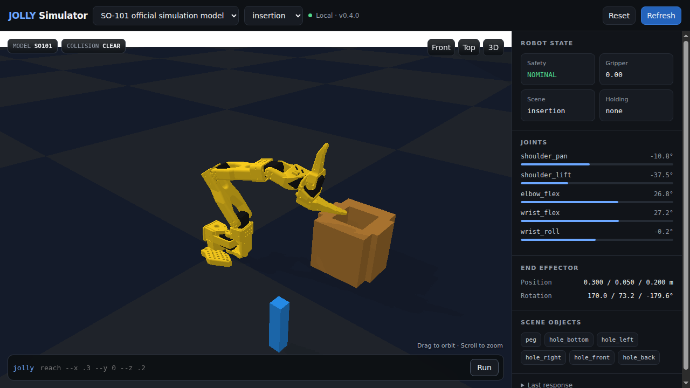

# Jolly CLI

Jolly is a local robot-arm physics simulator for terminal users and LLM agents.
It uses PyBullet in deterministic direct mode and saves state between commands.

Jolly includes two offline robot profiles:

- `jolly6`: an original six-axis arm with a parallel gripper.
- `so101`: the official five-axis SO-101 URDF and CAD meshes with a gripper.

The package also accepts scenes, challenges, an engine benchmark, a native
PyBullet viewer, and an optional local web viewer. No cloud service, MCP server,
API key, or network connection is required at runtime.

## See Jolly in action

### Local web simulator



The viewport above is a real PyBullet render of the official SO-101 CAD meshes.
It is not a diagram or a hand-drawn robot substitute.

### Terminal-native control


[Watch the MP4 recording](docs/assets/jolly-terminal-demo.mp4)

## Install

Install the command from PyPI with Python 3.10 or later:

```bash
python -m pip install jolly-cli
jolly state --json
```

For Python development, create a virtual environment on Python 3.10 or later:

```bash
python -m venv .venv
. .venv/bin/activate
pip install -e '.[web,dev]'
```

PyBullet publishes limited binary wheels. On platforms without a matching
wheel, use conda-forge or install a C++ build toolchain for the source build.

Install the local LLM skill with the Skills CLI:

```bash
npx skills add ./skills/jolly
```

## Quick start

```bash
jolly models --json
jolly reset --model so101 --scene blocks --json
jolly state --json
jolly move --joints "0,-20,40,-20,0" --gripper 0.0 --json
jolly reach --x 0.30 --y 0.10 --z 0.18 --gripper 0.0 --json
jolly render
jolly challenge list --json
jolly benchmark --json
```

Start the optional local web viewer:

```bash
jolly serve --host 127.0.0.1 --port 8765
```

Open `http://127.0.0.1:8765`. The JSON API documentation is at
`http://127.0.0.1:8765/api/docs`.

The clean web viewer displays the physical PyBullet world. PyBullet's local
TinyRenderer draws the official SO-101 STL meshes, scene objects, shadows, and
floor. Drag the viewport to orbit. Scroll to zoom. The viewer has no CDN,
external 3D service, or proprietary rendering dependency.

Open the native PyBullet window on a machine with a display:

```bash
jolly viewer --model so101 --scene blocks
```

## Command contract

All motion uses meters and degrees. Gripper `0.0` means open. Gripper `1.0`
means closed. Mutating commands save state under the operating system state
directory. Set `JOLLY_STATE_DIR` to isolate or relocate state.

Important commands:

| Command | Purpose |
| --- | --- |
| `jolly state --json` | Read joints, FK pose, collisions, objects, and grasp state. |
| `jolly move --joints CSV` | Move to exact joint angles. |
| `jolly reach --x X --y Y --z Z` | Solve IK and move to a Cartesian point. |
| `jolly fk [--joints CSV] --json` | Compute forward kinematics without saving a new pose. |
| `jolly render` | Show a Rich status table and terminal stick figure. |
| `jolly reset` | Select a model and scene, then home the robot. |
| `jolly scene list/load` | Discover and load deterministic scenes. |
| `jolly challenge list/start/status` | Run seeded randomized manipulation challenges. |
| `jolly benchmark [--seed N] [--cases N]` | Run randomized engine checks with reproducible inputs. |

Jolly rejects joint-limit violations and unsafe workspace targets. By default,
Jolly rolls back a motion that creates a collision. Use `--allow-collision`
only for controlled collision tests.

## Architecture

```text
jolly-cli/
├── pyproject.toml
├── README.md
├── SKILL.md
├── LICENSE-MIT
├── LICENSE-APACHE
├── THIRD_PARTY_LICENSES.md
├── jolly/
│   ├── cli.py
│   ├── benchmark.py
│   ├── challenges.py
│   ├── driver.py
│   ├── engine.py
│   ├── assets/
│   │   ├── jolly6.urdf
│   │   └── robots/so101/
│   │       ├── so101_new_calib.urdf
│   │       ├── assets/*.stl
│   │       ├── LICENSE-APACHE
│   │       ├── CITATION.cff
│   │       └── SOURCE.md
│   ├── core/
│   │   ├── physics.py
│   │   ├── models.py
│   │   ├── scenes.py
│   │   └── store.py
│   └── web/
│       ├── app.py
│       └── index.html
├── skills/jolly/SKILL.md
└── tests/
```

## Physics scope

`JollyEngine` owns state, safety, motion rollback, grasping, rendering, and the
public simulator contract. `JollyDriver` generates seeded challenge and
benchmark cases. The project does not depend on Inspect, Inspect AI, or an
external robotics benchmark driver.

PyBullet is the low-level open-source physics backend. It performs rigid-body
simulation, FK, IK, contact generation, and scene settling. Jolly uses
deterministic state restoration across short CLI processes.
The grasp helper attaches a nearby graspable object while the gripper is closed.
This helper makes terminal pick-and-place repeatable. It is not a soft-contact or
motor-current model.

## Randomized evaluation

Every challenge start generates a new target, object layout, or obstacle layout.
The result includes the seed and full instance so results stay auditable. Omit
`--seed` for a fresh unpredictable case. Supply a seed to reproduce a failure:

```bash
jolly challenge start sort-red --seed 42017 --json
jolly benchmark --seed 42017 --cases 5 --json
```

The benchmark generates new joint configurations for every robot case and new
object layouts for every scene case. This prevents a policy from passing only by
memorizing the original fixed coordinates.

The bundled SO-101 model is the official Apache-2.0 new-calibration URDF from
The Robot Studio. Jolly includes the 13 referenced STL meshes from pinned commit
`5f6d2b876a53a4872e405b991dd925556c9e38a4`. Jolly keeps the upstream files
unmodified and includes their license, citation, source record, and README.

## License

Jolly source code and original assets are available under your choice of the
MIT License or Apache License 2.0. See `LICENSE-MIT` and `LICENSE-APACHE`.
Third-party details appear in `THIRD_PARTY_LICENSES.md`.
